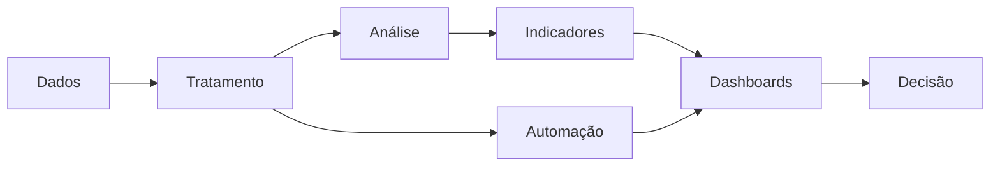

<div align="center">

# 👩🏽‍💻 Nathalia Ohana

### `Data Analytics` • `Business Intelligence` • `Automation`


<br>
    <a href="mailto:nathe557@gmail.com">
        
    </a>
    <a href="https://www.linkedin.com/in/nath%C3%A1lia-ohana-867524134/" target="_blank">
        
    </a>
</div>

---

## `SELECT * FROM profile;`

```sql
SELECT
    'Nathalia Ohana' AS name,
    'Engenharia da Computação' AS degree,
    'Data Analytics & Business Intelligence' AS focus,
    'Power BI · SQL · Python · Excel' AS core_stack;
```

Sou formada em **Engenharia da Computação**, com atuação direcionada a **Data Analytics e Business Intelligence**.

Tenho experiência com **análise e tratamento de dados, desenvolvimento de dashboards, construção de indicadores e automação de processos**, utilizando principalmente **Power BI, Excel, Python, SQL e Microsoft Power Platform**.

Atualmente curso **Pós-graduação em Segurança da Informação**, ampliando minha formação em tecnologia com conhecimentos de governança, segurança e gestão de riscos.

---

## `tech.stack()`

### Análise de Dados & Business Intelligence 📊


### Banco de Dados 🗄️


### Linguagens de Programação 💻


### Bibliotecas & Frameworks 🧩


### Automação & Microsoft Power Platform ⚙️


### Inteligência Artificial 🤖


### Linguagens de Marcação & Estilização 🎨


### Design & Prototipagem 🖌️


### Ambientes de Desenvolvimento 🛠️


### Produtividade & Gerenciamento 📋


### Tecnologias Complementares 🔧


---
## `core.skills`

- Análise, tratamento e exploração de dados
- Desenvolvimento de dashboards e relatórios
- Criação e acompanhamento de KPIs e indicadores
- Consultas, manipulação e análise de dados com SQL
- Automação de processos e fluxos de trabalho
- Integração entre Excel, Power BI, SharePoint e Power Platform
- Organização e documentação de processos
- Visualização de dados orientada à tomada de decisão

---
## `data.flow()`



Meu foco está na construção de soluções que conectem **dados, automação e visualização**, reduzindo tarefas manuais e transformando informações em indicadores úteis para acompanhamento e decisão.

---
## `education`

> * **Pós-graduação em Segurança da Informação** pela UNIFACS — `Em andamento`
> * **Bacharelado em Engenharia da Computação** pelo SENAI (Centro Universitário SENAI CIMATEC) — `08/2026`
> * **Técnica em Informática** pela Escola Técnica SENAI BAHIA — `07/2020`

---

## `certifications`

* [Programando em Python: da lógica de programação ao trabalho com dados abertos na web]([https://drive.google.com/](https://drive.google.com/file/d/1tvedL8vo1B9G_Vu3dZwhdfchwyBnPyia/view?usp=sharing))
* [Introdução à Cibersegurança]([https://drive.google.com/](https://drive.google.com/file/d/1C49i2JV22L_npnnSjV5la_nSu_10zOXw/view?usp=sharing))
* [Data Expert: O Fim dos Relatórios Amadores]([https://drive.google.com/](https://drive.google.com/file/d/1WYtttliQSJQslnzVL62ZE5coOJETTZlN/view?usp=sharing))
* [Imersão Gratuita: Análise de Dados na Prática]([https://drive.google.com/](https://drive.google.com/file/d/1-m0Ss5ztBnZ_YhjhlXUkpvl48oDPM-Xt/view?usp=sharing))
* [Imersão Power BI]([https://drive.google.com/](https://drive.google.com/file/d/1-neFN84QCkNKSqnJ-8axUbWn6BAMuM1W/view?usp=sharing))
* [Power BI Week](https://drive.google.com/file/d/12qi0Vinp6abtUrVi2OtKylCw5wt2f5Yj/view?usp=sharing)
* [Acelerador de Carreira com Power BI]([https://drive.google.com/](https://drive.google.com/file/d/1PM7dVAxZPxxD9JuZO2fNSfQcUJ57uStJ/view?usp=sharing))
* [Power BI Discovery]([https://drive.google.com/](https://drive.google.com/file/d/14b-mlKem_U2CzSsdJhstMIJrgbjyhCre/view?usp=sharing))
* [Power BI Series]([https://drive.google.com/](https://drive.google.com/file/d/1W3DbN0Owlu9PVpXnttrps3n1dQ36Wvdp/view?usp=sharing))
* [Minicurso de Power BI]([https://drive.google.com/](https://drive.google.com/file/d/1D1e02asp5ogBl8KfZxPgD_3HYYN8h_1o/view?usp=sharing))

---

<div align="center">

### `Data → Insight → Decision`

</div>

